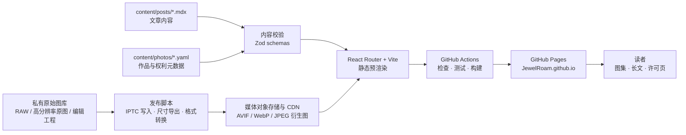
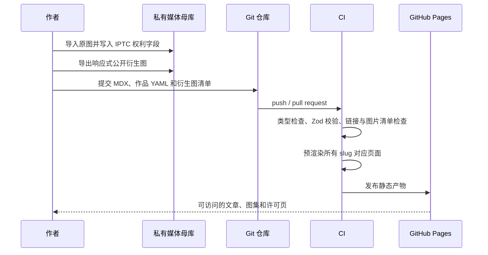

# JewelRoam 个人主页架构调研与实施蓝图

**作者：Manus AI**
**日期：2026-08-19**
**适用仓库：`JewelRoam/jewelroam.github.io`**

> **当前实现注记（2026-08-22）**：本文是早期架构研究与方案蓝图，不是当前运行时契约。当前代码已经采用 Vite + React Router + TypeScript + MDX + Zod，公开入口为 `Destinations`、`Journals`、`Capture`、`JewelRoam`，图片正式托管使用 Cloudflare R2。实施和发布细节以 `docs/codex/` 为准。

> **版权说明（非正式法律意见）**：本文件提供通用的产品、工程与信息架构建议，不构成正式法律意见。图片与文字通常在创作完成时即可获得版权保护，但权利归属、许可与可执行救济仍取决于适用法域与具体事实；在对外授权、维权或登记前，宜由合格法律专业人士复核。[1]

## 1. 执行摘要

仓库目前仅含一份初始 `README.md`，因而没有既有框架、内容模型或部署包袱，适合从一开始建立清晰的边界。建议将 JewelRoam 定位为一个**以静态内容为主、用 React 构建、在 GitHub Pages 发布的影像与长文档案站**。核心选型为 **React Router Framework Mode + Vite + TypeScript + MDX + Zod + GitHub Actions**，并使用 React Router 的静态预渲染能力为每一篇文章和每一个图集生成独立 HTML，而非仅交付一个客户端单页应用。[2]

该方案保留纯 React 开发体验，又适合 GitHub Pages 的静态托管模型。GitHub Pages 可直接发布仓库构建出的 HTML、CSS 与 JavaScript；对于用户主页仓库 `JewelRoam/jewelroam.github.io`，站点根路径应使用 `/`，部署过程由 GitHub Actions 构建产物后发布。[3] [4]

图片应是这个项目的独立子系统，而不是散落在组件中的 URL。**原始文件永不进入 Git 仓库、公开站点只引用经过导出与优化的衍生图、每一张图都拥有可验证的权利元数据**。这样可同时避免 GitHub Pages 的 1 GB 源仓库和发布站点建议上限，并为日后的图片量增长留出空间。[5]

| 决策 | 推荐 | 原因 |
| --- | --- | --- |
| 前端运行时 | React 19 + TypeScript | 用户指定 React；类型系统降低内容与组件演进风险。 |
| 应用框架 | React Router Framework Mode + Vite | React 路由与数据加载模型明确，支持 `ssr:false` 下静态预渲染。 |
| 内容格式 | MDX + YAML/JSON 元数据 | 文章自然书写，必要处可嵌入 React 内容组件；MDX 在构建阶段编译，不引入运行时解释器。[6] |
| 内容校验 | Zod | 构建时阻止缺少作者、日期、版权与图片尺寸的内容进入站点。 |
| 图片发布 | 对象存储/CDN 托管的衍生图 | 避开 Pages 容量与带宽压力，支持多尺寸、缓存和替换。 |
| 原始图保管 | 独立的私有备份库 | 原始 RAW、完整 EXIF/XMP 与编辑工程不对公网发布。 |
| 部署 | GitHub Actions → GitHub Pages | 每次合并 `main` 自动进行校验、构建与发布。 |
| 默认版权策略 | `All rights reserved` + 单独许可页 | 没有明确授予就不向公众授予复制、改编或商用权限。 |

## 2. 为什么不采用“纯 Vite SPA + 图片放仓库”

纯 Vite SPA 对快速制作首页足够，但它会把文章详情页、作品详情页和版权页的首屏内容交给浏览器运行后再绘制。对于希望长期积累、可被搜索、可直接分享深链接的博客和作品档案，这会引入不必要的路由回退、抓取和首屏阅读风险。React Router 的预渲染可在构建时为已知的静态路由生成 HTML；动态路径也可由文章或图集的 slug 列表枚举，这正符合内容由仓库管理的个人网站。[2]

另一方面，GitHub Pages 是静态站点托管服务，而不是通用媒体库。其源仓库和已发布站点均建议不超过 1 GB，并有每月 100 GB 的软带宽限制；图像原文件、超大 JPEG 或视频将很快挤占这类配额。[5] 因此，Git 仓库只管理文章、结构化描述和前端代码，媒体衍生图放在专用存储与 CDN 上，才是图片密集站的长期可维护结构。

## 3. 目标架构



这个架构把**创作资产**、**内容语义**、**前端呈现**和**发布渠道**分开。图片文件可以被替换或扩展尺寸，而不改动文章 URL；版权字段可在作品页、JSON-LD 和页脚复用，而不用将同一声明复制到多处；路由只消费经过校验的内容索引，而不直接扫描界面层文件。

## 4. 推荐目录与职责边界

以下为目标仓库的建议目录。`app/` 仅管理界面、路由与展示逻辑；`content/` 是可审阅的编辑资产；`scripts/` 只管理构建前校验与媒体清单生成。不要让组件层直接维护文章正文、长数组或版权常量。

```text
jewelroam.github.io/
├── app/
│   ├── root.tsx                         # 全局布局、字体、站点级 metadata
│   ├── routes.ts                        # 路由清单
│   ├── routes/
│   │   ├── home.tsx
│   │   ├── essays._index.tsx            # 文章索引
│   │   ├── essays.$slug.tsx             # 单篇文章（预渲染）
│   │   ├── archive._index.tsx           # 图集 / 作品索引
│   │   ├── archive.$series.tsx          # 系列页（预渲染）
│   │   ├── photos.$id.tsx               # 单张作品页（预渲染）
│   │   ├── jewelroam.tsx
│   │   ├── rights.tsx                   # 使用许可与联系入口
│   │   └── privacy.tsx
│   ├── components/
│   │   ├── layout/                      # Header、ArchiveSidebar、Footer
│   │   ├── media/                       # ResponsiveImage、Lightbox、PhotoCaption
│   │   ├── prose/                       # MDX 可嵌入组件
│   │   └── rights/                      # RightsBadge、LicenseNotice
│   ├── features/
│   │   ├── essays/                      # 文章索引、相邻文章与目录
│   │   ├── archive/                     # 系列筛选、作品卡片与画廊
│   │   └── search/                      # 可选的构建期搜索索引
│   ├── lib/
│   │   ├── content/                     # 读取、解析、排序内容
│   │   ├── metadata/                    # JSON-LD 和页面 metadata
│   │   ├── routes/                      # URL 生成与 slug 规范
│   │   └── utils/
│   └── styles/
│       ├── tokens.css                   # 色彩、排版、空间、动效 token
│       └── globals.css
├── content/
│   ├── posts/                           # 一篇文章一个 MDX 文件
│   ├── photo-series/                    # 一组作品一个 YAML 文件
│   ├── photos/                          # 一张图片一个 YAML 文件
│   ├── pages/                           # jewelroam / rights 的可编辑内容
│   └── schemas/                         # Zod schema 与内容加载器
├── public/
│   ├── favicon.svg
│   ├── robots.txt
│   └── CNAME                            # 仅在绑定自定义域名时加入
├── scripts/
│   ├── validate-content.mts             # 内容、日期、URL、权利字段检查
│   ├── build-search-index.mts           # 可选：构建期搜索索引
│   └── check-media-manifest.mts         # 验证 CDN 文件及尺寸描述
├── .github/workflows/pages.yml          # CI 与 Pages 发布
├── react-router.config.ts               # ssr:false + prerender 路径
└── package.json
```

### 4.1 内容域模型

`Photo` 是版权与媒介层的最小原子；`PhotoSeries` 只编排图片、叙述和顺序；`Post` 可引用封面图片和关联作品，但不重复定义图片版权。这样一张图片出现在首页、图集页和文章页时，所有权利展示仍来自同一数据源。

| 实体 | 必填字段 | 关键约束 |
| --- | --- | --- |
| `Photo` | `id`、`title`、`alt`、`takenAt`、`dimensions`、`renditions`、`rights` | `id` 永不复用；每一幅公开图片都有可访问的 `rights.licenseUrl`。 |
| `PhotoSeries` | `slug`、`title`、`summary`、`photoIds`、`publishedAt` | `photoIds` 必须存在且顺序稳定；系列删除前先处理被文章引用的图片。 |
| `Post` | `slug`、`title`、`description`、`publishedAt`、`tags`、`body` | 不在正文硬编码 CDN URL；统一以图片 `id` 引用。 |
| `RightsPolicy` | `owner`、`notice`、`licenseType`、`licenseUrl`、`contactUrl` | 默认 `all-rights-reserved`；任何非默认许可必须显式配置。 |

### 4.2 内容示例

```yaml
# content/photos/2026-coast-window.yaml
id: 2026-coast-window
title: 海岸线旁的车窗
alt: 清晨列车车窗外的雾岛与平静海面
takenAt: 2026-04-16
location: Seto Inland Sea, Japan
dimensions: { width: 6048, height: 4032 }
renditions:
  avif: [640, 1280, 2048]
  webp: [640, 1280, 2048]
  fallback: 1280
rights:
  owner: JewelRoam
  notice: "© 2026 JewelRoam. All rights reserved."
  licenseType: all-rights-reserved
  licenseUrl: https://jewelroam.github.io/jewelroam#rights
  acquireLicenseUrl: https://jewelroam.github.io/jewelroam#rights
  iptcEmbedded: true
  visibleWatermark: false
```

```mdx
---
title: 潮湿的春日车窗
slug: wet-spring-window
description: 从海岸列车上写下的一次缓慢观察。
publishedAt: 2026-05-04
tags: [旅行, 影像, 日本]
coverPhotoId: 2026-coast-window
rights: all-rights-reserved
---

正文以 Markdown 书写；只有需要图注、图片组合、旁注或地图时才引入已登记的 React 组件。

<PhotoRef id="2026-coast-window" variant="wide" />
```

## 5. 图片资产策略

### 5.1 两个存储层，而不是一个仓库

建议维护一个私有“母库”和一个公开“发行库”。母库保存 RAW、最高分辨率原图、Lightroom/Capture One 工程和导出历史；发行库只提供经过尺寸限制、压缩并附带识别信息的公开版本。不要将能用于杂志印刷或商业再发布的全尺寸原图暴露在公共页面。

| 层级 | 存放内容 | 是否进入 Git | 是否公开 | 目的 |
| --- | --- | --- | --- |
| 母库 | RAW、全尺寸原图、编辑工程、完整元数据 | 否 | 否 | 备份、证据保留、长期再编辑。 |
| 内容库 | MDX、YAML、alt 文本、图注、权利信息、衍生图 URL | 是 | 是 | 可审阅、可追踪、可重复构建。 |
| 发行库 | 640/1280/2048px 的 AVIF、WebP、JPEG 回退图 | 否 | 是 | 快速交付、缓存、响应式展示。 |

### 5.2 衍生图标准

发布前为每张图片生成 640、1280 和 2048px 的长边版本；优先输出 AVIF，并保留 WebP/JPEG 回退。前端通过 `<picture>`、`srcset` 与 `sizes` 让浏览器选择匹配视口和像素密度的版本。对首屏主图使用 `loading="eager"` 与谨慎的 `fetchpriority="high"`，其余画廊图片使用 `loading="lazy"`，并始终提供 `width`/`height` 防止布局跳动。[7] [8]

```tsx
<picture>
  <source type="image/avif" srcSet={photo.avifSrcSet} sizes={gallerySizes} />
  <source type="image/webp" srcSet={photo.webpSrcSet} sizes={gallerySizes} />
  
</picture>
```

主页首屏只加载一张主视觉和一张小型预览图；不要在首次加载时请求整组图集。画廊可按系列分段加载，放大查看仅请求当前图与相邻两张的合适尺寸。所有图片文本替代均从内容模型读取，装饰图片的 `alt` 为空而非省略。

## 6. 版权、许可和防滥用的分层方案

公开到浏览器的文件无法从技术上被完全阻止保存或截屏。因此不建议把“禁用右键”“阻止拖动”当作保护措施，它们损害可用性也不构成实质保护。应采用**权利可见、来源可追踪、原图不公开、许可可联系、保留创作记录**的五层组合。

世界知识产权组织指出，作品一般自创作完成时即受版权保护，且公开作品附上版权声明可提醒使用者、表明权利人并简化许可联系。[1] 这解释了为什么站点需要声明和元数据，但不意味着任何单一技术可以替代正式的权利管理或法律程序。

| 层级 | 必须实施 | 作用 | 不应夸大的能力 |
| --- | --- | --- | --- |
| 页面声明 | 全站页脚、文章尾注、每张作品详情页显示 `© 年份 JewelRoam` 与使用链接 | 明确权利人与访问许可入口。 | 不能自动阻止复制。 |
| 默认许可 | 原创文章与图片默认 `All rights reserved`；建立 `/rights` 页面说明转载、授权、署名和联系方式 | 不因“未说明”而让读者误解为自由商用。 | 不能替代针对特定合作的书面协议。 |
| 文件元数据 | 在发布导出前写入 IPTC Creator、Copyright Notice、Credit Line、Web Statement of Rights、Licensor URL | 元数据可随文件流转；IPTC 是图片管理与版权信息的通用标准。[9] | 平台或二次导出可能会去除元数据。 |
| 结构化数据 | 每个作品详情页输出 `ImageObject` JSON-LD：`contentUrl`、`creator`、`copyrightNotice`、`license`、`acquireLicensePage` | Google Images 可读取作者、使用方式和授权信息，图片可具备获得 Licensable 标记的资格。[10] | 展示由搜索平台决定，不能保证。 |
| 公开分辨率 | 仅发布适合屏幕浏览的衍生图；全尺寸原图留在私有母库 | 降低高质量再利用的便利性。 | 不能防止对公开版本的盗用。 |
| 水印策略 | 对高风险、商业价值高的精选预览图使用可见边缘水印或不可见水印；纯作品集默认不覆盖画面主体 | 提高误用成本，并帮助追踪来源。 | 水印可能被裁切，且会影响审美与阅读。 |
| 留档与响应 | 保留 RAW、带时间的导出记录、发布清单、Git 历史和侵权截图；在 `/rights` 放置联系渠道 | 为事后证明创作和处理请求提供记录。 | 不对任何具体法域的维权结果作保证。 |

### 6.1 必须写入的图片元数据

在 Lightroom、Capture One、Photo Mechanic 或导出脚本中统一写入如下字段。压缩或格式转换时需要明确保留这些权利字段；Google 也建议在优化图片时至少保留 Creator、Credit Line 与 Copyright Notice。[10]

```text
Creator              = JewelRoam / 实名或工作室名
Credit Line          = © JewelRoam
Copyright Notice     = © 2026 JewelRoam. All rights reserved.
Web Statement Rights = https://jewelroam.github.io/jewelroam#rights
Licensor URL         = https://jewelroam.github.io/jewelroam#rights
Source               = Original photograph by JewelRoam
```

对包含 AI 生成或 AI 实质编辑的图像，应在内容字段中记录其来源与处理方法，避免将其与完全摄影作品混为一谈。Google 文档已列出可用于表达数字来源类型的 IPTC 字段与 C2PA 信息，但是否在搜索结果中显示并非由站点单方面决定。[10]

### 6.2 JSON-LD 的统一生成方式

不要让编辑者在 MDX 内手写 JSON-LD。由 `buildImageObjectJsonLd(photo)` 根据 `Photo` 内容模型统一生成，避免许可 URL、版权年份和作品 URL 不一致。

```json
{
  "@context": "https://schema.org",
  "@type": "ImageObject",
  "contentUrl": "https://images.example.com/2026-coast-window-1280.webp",
  "creator": { "@type": "Person", "name": "JewelRoam" },
  "creditText": "JewelRoam",
  "copyrightNotice": "© 2026 JewelRoam. All rights reserved.",
  "license": "https://jewelroam.github.io/jewelroam#rights",
  "acquireLicensePage": "https://jewelroam.github.io/jewelroam#rights"
}
```

## 7. 内容与发布工作流

推荐先采用“Git 驱动编辑”：每个变更通过分支或提交进入仓库，在 CI 中被验证并生成静态预览。单人维护时，这比引入动态 CMS 更简单、可审计且不需要后端；以后若出现多作者、审批流或非技术编辑，再把 `content/` 抽象成独立的内容提供者，不改变 `Photo`/`Post` 的领域模型。



### 7.1 CI 的质量闸门

每次 Pull Request 和 `main` 推送必须顺序执行内容校验、静态检查、测试、构建与产物检查。部署仅在 `main` 成功构建后进行。Vite 官方的 Pages 部署方案亦以 GitHub Actions 构建后上传 `dist` 产物为基础；此用户主页仓库使用根路径 `base: '/'`。[4]

| 检查 | 失败条件示例 |
| --- | --- |
| `content:validate` | slug 重复、无 `alt`、无 `rights`、文章引用不存在的 `photoId`、日期格式错误。 |
| `typecheck` | 路由 loader 或组件 props 违反类型。 |
| `test` | 内容排序、URL 生成、权利标签显示、JSON-LD 生成结果异常。 |
| `build` | 任意预渲染 slug 构建失败；产物中未生成预期路径。 |
| `asset:check` | CDN 的每个 `srcset` URL 缺失、尺寸与 manifest 不一致、链接的 license 页不存在。 |
| `quality:budget` | 初始 JS、CSS、首屏图片或单页图片数量超过预设预算。 |

## 8. 路由与页面优先级

“首页像门厅、档案像书架、文章像阅读桌、许可像明确的使用说明”是信息架构的主线。主页不应堆砌所有历史内容；它只展示当下的自我介绍、精选系列、最新文章和清晰的档案入口。

| 路径 | 目的 | 必要内容 | 预渲染 |
| --- | --- | --- | --- |
| `/` | 快速理解作者与最新创作 | 简介、精选图集、最新文章、联系入口 | 是 |
| `/archive` | 浏览影像归档 | 系列、地点/主题筛选、作品数量 | 是 |
| `/archive/:series` | 阅读一个影像系列 | 系列叙述、排序后的图片、图注、系列版权 | 是 |
| `/photos/:id` | 提供单图语义与权利页 | 大图、标题、拍摄信息、`ImageObject`、许可入口 | 是 |
| `/essays` | 浏览长文 | 时间、主题、摘要、阅读时长 | 是 |
| `/essays/:slug` | 认真阅读一篇文章 | 目录、MDX 正文、关联作品、文章版权尾注 | 是 |
| `/rights` | 版权与许可处理 | 默认权利声明、商业/转载咨询路径、署名格式 | 是 |
| `/jewelroam` | 建立信任与联系 | 作者介绍、创作范围、联系方法 | 是 |

## 9. 分阶段实施计划

### 阶段 A：项目骨架与内容边界

初始化 React Router + Vite + TypeScript，建立上述目录、路由和 Zod 内容 schema。此阶段只放少量真实样本内容，用于验证建模；不要以大量临时占位图或伪造读者评价填充页面。完成标准是主页、文章列表、文章详情、图集、作品详情、权利页均能由内容文件驱动并成功预渲染。

### 阶段 B：媒体发行管线

确定对象存储/CDN 和域名策略，建立“导入原图 → 写 IPTC → 导出多尺寸 → 上传发行库 → 更新 manifest”的脚本。首先处理 20–30 张代表图片，验证真实手机网络下的加载速度、图集尺寸、caption、alt 和许可链接。完成标准是代码仓库中没有大图二进制，所有公开图片均有尺寸、alt、版权和许可信息。

### 阶段 C：版权可见化与搜索语义

添加全局版权页、作品页权利卡、文章尾注、JSON-LD 和 `sitemap.xml`。使用结构化数据测试器检查真实页面，保留核心 IPTC 字段。完成标准是每个作品页都能从唯一内容记录生成一致的页面声明与机器可读信息。

### 阶段 D：发布自动化与维护基线

配置 GitHub Actions、预览检查、Pages 发布、测试和资源预算。将 `README.md` 改写成面向日后维护者的操作手册：如何新增文章、如何新增图片、如何修改许可、如何本地预览、何时不要把原图提交到 Git。完成标准是一次普通文章更新不需要改动 React 组件或部署脚本。

## 10. 需要由站长确认的事项

在开始编码前，需要明确下列业务决策。它们会影响内容 schema、版权页文案、图片存储和生成流程，而不是视觉细节。

| 决策项 | 推荐默认值 | 影响 |
| --- | --- | --- |
| 公开图片最大尺寸 | 长边 2048px | 决定导出与 CDN 流量。 |
| 默认许可 | All rights reserved | 决定每张图和每篇文章显示的权利语义。 |
| 许可联系通道 | 专用邮箱或联系表单 | 决定 `acquireLicensePage` 的完整性。 |
| 原图备份位置 | 私有云盘/对象存储 + 本地副本 | 决定长期资产安全。 |
| 图像水印 | 仅高风险预览图使用 | 在保护、视觉完整性和可读性间取舍。 |
| 自定义域名 | 后续可加 | 影响 `CNAME`、规范 URL、JSON-LD 与 CDN 域名。 |
| 编辑方式 | 初期 Git + MDX | 保持单人维护简单；以后可平滑接 CMS。 |

## 11. 最终建议

应从一开始把 JewelRoam 当成一个**出版系统**，而不是一组 React 页面：文章是经过 schema 校验的 MDX，图片是具有衍生图和权利字段的内容实体，页面是由路由在构建期预渲染出的静态阅读界面，GitHub Actions 是唯一的发布入口。这样既满足 React 技术栈，又能支撑持续积累的博客与图片归档。

最重要的两条边界是：**不将原始高分辨率图片放入公共 Git 仓库，也不在组件里手写版权与图片 URL。**前者保护资产和部署配额，后者保护代码与内容的长期可维护性。页面层负责优雅呈现，内容层负责真实信息，媒体层负责高效传输，版权层负责清晰表达和可联系授权。

## References

[1]: [World Intellectual Property Organization — How to Obtain Copyright Protection](https://www.wipo.int/en/web/copyright/protection)
[2]: [React Router — Pre-Rendering](https://reactrouter.com/how-to/pre-rendering)
[3]: [GitHub Docs — What is GitHub Pages?](https://docs.github.com/en/pages/getting-started-with-github-pages/what-is-github-pages)
[4]: [Vite — Deploying a Static Site: GitHub Pages](https://vite.dev/guide/static-deploy)
[5]: [GitHub Docs — GitHub Pages limits](https://docs.github.com/en/pages/getting-started-with-github-pages/github-pages-limits)
[6]: [MDX — Markdown for the component era](https://mdxjs.com/)
[7]: [web.dev — Responsive images](https://web.dev/learn/design/responsive-images)
[8]: [web.dev — Browser-level image lazy loading for the web](https://web.dev/articles/browser-level-image-lazy-loading)
[9]: [IPTC — Photo Metadata](https://iptc.org/standards/photo-metadata/)
[10]: [Google Search Central — Image metadata in Google Images](https://developers.google.com/search/docs/appearance/structured-data/image-license-metadata)
